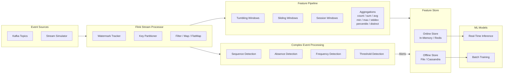

<div align="center">

# Flink Real-Time Feature Computation Engine

**Motor de Computacao de Features em Tempo Real com Apache Flink**

[](https://www.python.org/downloads/)
[](LICENSE)
[](Dockerfile)
[](#running-tests)
[](https://peps.python.org/pep-0008/)
[](https://github.com/gabriellafis/flink-realtime-feature-computation/pulls)

A production-grade stream processing engine for computing ML features in real time.
Built on Apache Flink patterns with windowed aggregations, complex event processing,
and a dual online/offline feature store.

Um motor de processamento de streams de nivel de producao para computacao de features
de ML em tempo real. Construido sobre padroes do Apache Flink com agregacoes em janelas,
processamento de eventos complexos e um feature store dual online/offline.

---

[Architecture](#architecture) |
[Quick Start](#quick-start--inicio-rapido) |
[Features](#key-features--funcionalidades-principais) |
[Usage](#usage--uso) |
[Tests](#running-tests--executando-testes) |
[Docker](#docker) |
[Contributing](#contributing--contribuicao)

</div>

---

## Architecture / Arquitetura

The engine follows a modular pipeline architecture where events flow from sources through
processing stages into a unified feature store. Each component is decoupled and independently
testable.

A engine segue uma arquitetura de pipeline modular onde eventos fluem das fontes, passam por
estagios de processamento e chegam a um feature store unificado. Cada componente e desacoplado
e testavel independentemente.



---

## Key Features / Funcionalidades Principais

### Stream Processing / Processamento de Streams

- **Event-time and processing-time** semantics with configurable watermark strategies
- **Operator chaining**: filter, map, flat_map, key_by with fluent API
- **Late event handling** with configurable allowed lateness and side outputs
- **Backpressure detection** with automatic monitoring thresholds

### Windowed Aggregations / Agregacoes em Janelas

- **Tumbling windows**: fixed-size, non-overlapping time intervals
- **Sliding windows**: overlapping windows with configurable slide interval
- **Session windows**: dynamic windows based on activity gaps per key
- **10 aggregation functions**: count, sum, avg, min, max, distinct_count, percentile, stddev, first_value, last_value

### Complex Event Processing (CEP) / Processamento de Eventos Complexos

- **Sequence patterns**: detect ordered event sequences within time windows (e.g., browse then purchase)
- **Absence patterns**: alert when expected follow-up events do not occur (e.g., cart abandonment)
- **Frequency patterns**: trigger on N occurrences within a time window (e.g., rapid searches)
- **Threshold patterns**: fire when event properties exceed configured limits (e.g., high-value purchases)

### Feature Store / Armazem de Features

- **Online store**: microsecond-latency in-memory serving (Redis-backed in production)
- **Offline store**: append-only historical log for batch ML training (Cassandra-backed in production)
- **Feature versioning**: full version history with point-in-time lookups
- **TTL management**: automatic expiration and cleanup of stale features
- **Batch operations**: multi-entity, multi-feature retrieval in a single call

### Monitoring / Monitoramento

- **Latency histograms**: mean, median, p95, p99 with sliding window
- **Throughput counters**: events/second with configurable measurement windows
- **Feature freshness tracking**: time since last computation per feature
- **Backpressure status**: none / moderate / high / critical levels

---

## Industry Applications / Aplicacoes na Industria

This engine addresses real-world ML feature computation needs across several domains:

| Domain | Use Case | Features Computed |
|--------|----------|-------------------|
| **E-commerce** | Personalization, recommendation | Page views, cart activity, purchase history |
| **Fraud Detection** | Transaction scoring | Spending velocity, location changes, device patterns |
| **IoT / Sensors** | Predictive maintenance | Sensor aggregations, anomaly windows, drift detection |
| **Financial Trading** | Signal generation | Price moving averages, volume spikes, spread tracking |
| **Recommendations** | Content ranking | Click-through rates, session depth, engagement scores |

---

## Quick Start / Inicio Rapido

### Prerequisites / Pre-requisitos

- Python 3.10 or higher
- No external services required for the demo (Kafka, Redis, and Cassandra are optional)

### Installation / Instalacao

```bash
# Clone the repository / Clone o repositorio
git clone https://github.com/gabriellafis/flink-realtime-feature-computation.git
cd flink-realtime-feature-computation

# Install dependencies / Instale as dependencias
pip install -r requirements.txt

# Run the demo / Execute a demonstracao
python main.py
```

Or using Make:

```bash
make install
make run
```

---

## Usage / Uso

### Running the Demo / Executando a Demonstracao

The demo generates 500 realistic e-commerce events across 20 simulated users and processes
them through the complete pipeline:

```bash
python main.py
```

### Example Output / Exemplo de Saida

```
    ╔══════════════════════════════════════════════════════════════════╗
    ║    ███████╗██╗     ██╗███╗   ██╗██╗  ██╗                       ║
    ║    █████╗  ██║     ██║██╔██╗ ██║█████╔╝                        ║
    ║    ██║     ███████╗██║██║ ╚████║██║  ██╗                       ║
    ║    Real-Time Feature Computation Engine                        ║
    ╚══════════════════════════════════════════════════════════════════╝

━━━━━━━━━━━━━━━━━━━━━━━━━━━━━━━━━━━━━━━━━━━━━━━━━━━━━━━━━━━━━━━━━━
  1. Initializing Pipeline Components
━━━━━━━━━━━━━━━━━━━━━━━━━━━━━━━━━━━━━━━━━━━━━━━━━━━━━━━━━━━━━━━━━━

  [OK] Kafka Source Simulator (20 users, 50 events/s)
  [OK] Stream Processor (event-time, watermark=5s)
  [OK] Feature Store (online + versioning)
  [OK] Feature Pipeline (8 features registered)
  [OK] Complex Event Processor (4 patterns)

━━━━━━━━━━━━━━━━━━━━━━━━━━━━━━━━━━━━━━━━━━━━━━━━━━━━━━━━━━━━━━━━━━
  4. Computed Features Summary
━━━━━━━━━━━━━━━━━━━━━━━━━━━━━━━━━━━━━━━━━━━━━━━━━━━━━━━━━━━━━━━━━━

  Total feature computations: 127
  Unique feature types: 8

  Feature Name                          Count  Users     Avg Value     Max Value
  ---------------------------------------------------------------------------
  avg_spend_per_purchase_5m                12      8        87.42       198.50
  cart_additions_5m                        14     10         2.14         5.00
  page_view_count_5m                       18     14         4.22        11.00
  search_count_5m                          16     12         3.06         8.00
  session_event_count                      20     18         6.40        15.00
  total_spend_5m                           12      8       174.85       397.00

━━━━━━━━━━━━━━━━━━━━━━━━━━━━━━━━━━━━━━━━━━━━━━━━━━━━━━━━━━━━━━━━━━
  7. Pipeline Metrics Report
━━━━━━━━━━━━━━━━━━━━━━━━━━━━━━━━━━━━━━━━━━━━━━━━━━━━━━━━━━━━━━━━━━

  Events:
    Processed:           500
    Late:                 40
    Dropped:               0

  Processing Latency:
    Mean:            0.012 ms
    P95:             0.024 ms
    P99:             0.041 ms

  Feature Store:
    Online sets:          127
    Hit rate:          82.5%

━━━━━━━━━━━━━━━━━━━━━━━━━━━━━━━━━━━━━━━━━━━━━━━━━━━━━━━━━━━━━━━━━━
  Pipeline Execution Complete
━━━━━━━━━━━━━━━━━━━━━━━━━━━━━━━━━━━━━━━━━━━━━━━━━━━━━━━━━━━━━━━━━━

  Summary:
    Events processed:     500
    Features computed:    127
    Alerts generated:      23
    Entities in store:     20
    Processing time:      0.18s
    Throughput:           2778 events/s
```

*(Actual values vary per run due to randomized event generation.)*

### Programmatic Usage / Uso Programatico

```python
from src.stream.source import KafkaSourceSimulator
from src.stream.processor import StreamProcessor, TimeCharacteristic
from src.features.feature_pipeline import FeaturePipeline, FeatureDefinition
from src.store.feature_store import FeatureStore

# 1. Set up the feature store
store = FeatureStore(enable_versioning=True)

# 2. Define features
pipeline = FeaturePipeline()
pipeline.register_feature(FeatureDefinition(
    name="purchase_count_5m",
    aggregation="count",
    window_type="tumbling",
    window_size_seconds=300,
    source_field="_count",
    filter_event_type="purchase",
))

# 3. Process events
source = KafkaSourceSimulator(num_users=100)
processor = StreamProcessor(time_characteristic=TimeCharacteristic.EVENT_TIME)

for event in source.stream(max_events=1000):
    processor.process_event(event)
    pipeline.process_event(event)

# 4. Trigger feature computation
features = pipeline.trigger(watermark=processor.current_watermark.timestamp)

# 5. Store and serve
for feat in features:
    store.set_features(feat.entity_id, {feat.feature_name: feat.feature_value})

# 6. Serve to ML model
user_features = store.get_features("user_042", ["purchase_count_5m"])
```

---

## Project Structure / Estrutura do Projeto

```
flink-realtime-feature-computation/
|
|-- src/
|   |-- config/           # Configuration management (YAML, dataclasses)
|   |   |-- settings.py   # FlinkConfig, KafkaConfig, RedisConfig, etc.
|   |
|   |-- kafka/            # Kafka integration layer
|   |   |-- consumer.py   # FeatureEventConsumer with batch support
|   |   |-- producer.py   # FeatureEventProducer with serialization
|   |   |-- schema_registry.py  # Schema versioning and compatibility
|   |
|   |-- storage/          # Storage backends
|   |   |-- redis_store.py      # Online store (Redis)
|   |   |-- cassandra_store.py  # Offline store (Cassandra)
|   |   |-- dual_store.py       # Dual-write orchestrator
|   |
|   |-- stream/           # Stream processing core
|   |   |-- source.py     # KafkaSourceSimulator with e-commerce events
|   |   |-- processor.py  # StreamProcessor with watermarks and operators
|   |   |-- sink.py       # FeatureStoreSink with buffering and flush
|   |
|   |-- features/         # Feature computation engine
|   |   |-- aggregations.py    # Tumbling, Sliding, Session windows
|   |   |-- feature_pipeline.py # FeaturePipeline orchestrator
|   |   |-- cep.py             # Complex Event Processor
|   |
|   |-- store/            # Unified feature store
|   |   |-- feature_store.py   # Online/Offline with versioning and TTL
|   |
|   |-- monitoring/       # Observability layer
|   |   |-- metrics.py    # Latency, throughput, freshness, backpressure
|   |
|   |-- utils/            # Shared utilities
|       |-- logger.py     # Structured JSON logging
|
|-- tests/                # Unit test suite (64 tests)
|-- config/               # Pipeline configuration (YAML)
|-- docker/               # Docker and docker-compose setup
|-- .github/workflows/    # CI pipeline (GitHub Actions)
|-- main.py               # Complete demo script
|-- Makefile              # Build automation
|-- requirements.txt      # Python dependencies
```

---

## Running Tests / Executando Testes

The project includes 64 unit tests covering all core modules:

```bash
# Run all tests / Executar todos os testes
pytest tests/ -v

# Run with coverage / Executar com cobertura
pytest tests/ --cov=src --cov-report=term-missing

# Run a specific test module / Executar um modulo de teste especifico
pytest tests/test_aggregations.py -v

# Run tests matching a pattern / Executar testes por padrao
pytest tests/ -k "window" -v
```

### Test Coverage / Cobertura de Testes

| Module | Tests | Scope |
|--------|-------|-------|
| `test_stream_source.py` | 7 | Event generation, serialization, sessions, late events |
| `test_stream_processor.py` | 8 | Filtering, mapping, key partitioning, watermarks, state |
| `test_aggregations.py` | 12 | Tumbling/sliding/session windows, all aggregation functions |
| `test_feature_pipeline.py` | 5 | Registration, routing, computation, callbacks |
| `test_cep.py` | 7 | Sequence, absence, frequency, threshold patterns |
| `test_feature_store.py` | 12 | CRUD, TTL, versioning, point-in-time, batch ops |
| `test_metrics.py` | 7 | Histograms, throughput, freshness, backpressure |
| `test_sink.py` | 6 | Buffering, flush policies, deduplication, batching |

---

## Docker

The full infrastructure stack is available via Docker Compose:

```bash
# Start all services / Iniciar todos os servicos
docker-compose -f docker/docker-compose.yml up -d

# Or using Make / Ou usando Make
make docker-up

# Stop services / Parar servicos
make docker-down
```

### Services Included / Servicos Incluidos

| Service | Port | Purpose |
|---------|------|---------|
| Kafka | 9092 | Event streaming |
| Zookeeper | 2181 | Kafka coordination |
| Schema Registry | 8081 | Schema management |
| Redis | 6379 | Online feature store |
| Cassandra | 9042 | Offline feature store |
| Flink JobManager | 8082 | Stream processing UI |
| Flink TaskManager | -- | Processing workers (x2) |

---

## Configuration / Configuracao

Pipeline behavior is controlled through `config/pipeline_config.yaml`:

```yaml
features:
  - name: "purchase_count_5m"
    aggregation: "count"
    window_type: "tumbling"
    window_size_seconds: 300
    source_field: "_count"
    filter_event_type: "purchase"

cep_patterns:
  - name: "cart_abandonment"
    pattern_type: "absence"
    event_types: ["add_to_cart", "purchase"]
    time_window_seconds: 120

monitoring:
  report_interval_seconds: 30
  latency_threshold_ms: 100
```

---

## Contributing / Contribuicao

Contributions are welcome! Here is how you can help:

Contribuicoes sao bem-vindas! Veja como voce pode ajudar:

1. Fork the repository / Faca um fork do repositorio
2. Create a feature branch / Crie uma branch para sua feature (`git checkout -b feature/my-feature`)
3. Write tests for your changes / Escreva testes para suas alteracoes
4. Make sure all tests pass / Certifique-se de que todos os testes passam (`make test`)
5. Submit a pull request / Envie um pull request

---

## License / Licenca

This project is licensed under the MIT License. See [LICENSE](LICENSE) for details.

Este projeto esta licenciado sob a Licenca MIT. Veja [LICENSE](LICENSE) para detalhes.

---

<div align="center">

**Built with care by [Gabriel Demetrios Lafis](https://github.com/gabriellafis)**

*Construido com cuidado por [Gabriel Demetrios Lafis](https://github.com/gabriellafis)*

</div>
